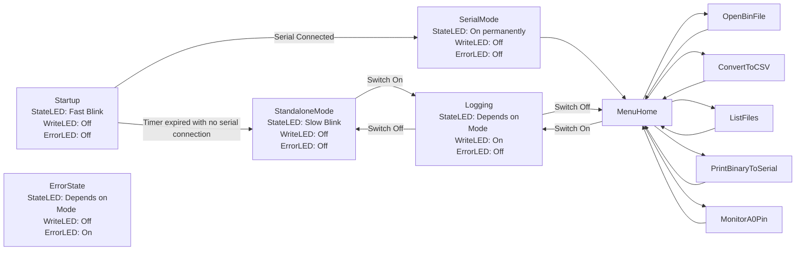

# feather_strain_logger
Adafruit Strain Logger using Board from Brendan Zotto

This is based on the AvrAdcLogger project with modifications to fit this board. 

# Required libraries
This projet leverages the following: 
- [MAX5481](https://github.com/robertfchapman/MAX5481)
- SdFat

# State Chart

